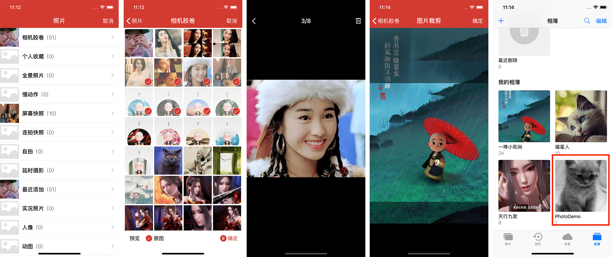

# MMPhotoPicker

[](https://raw.githubusercontent.com/ChellyLau/MMPhotoPicker/master/LICENSE)&nbsp;
[](http://cocoapods.org/pods/MMPhotoPicker)&nbsp;
[](http://cocoapods.org/pods/MMPhotoPicker)&nbsp;




`MMPhotoPicker`基于`Photos`框架，集成了图片选择器（支持多选、单选、对图片进行裁剪、选择原图、可预览）以及创建自定义相册，并保存图片到自定义相册。基于`AssetsLibrary`框架的图片选择器，可以参考[MMImagePicker](https://github.com/ChellyLau/MMImagePicker)。


## 属性

```objc
MMPhotoPickerController属性介绍：
   
// 主色调[默认红色]
@property (nonatomic, strong) UIColor *mainColor;
// 是否回传原图 [可用于控制图片压系数]
@property (nonatomic, assign) BOOL isOrigin;
// 是否显示原图选项 [默认NO]
@property (nonatomic, assign) BOOL showOriginImageOption;
// 是否显示空相册 [默认NO]
@property (nonatomic, assign) BOOL showEmptyAlbum;
// 是否只选取一张 [默认NO]
@property (nonatomic, assign) BOOL singleImageOption;
// 是否选取一张且需要裁剪 [默认NO]
@property (nonatomic, assign) BOOL cropImageOption;
// 裁剪的大小[默认方形、屏幕宽度]
@property (nonatomic, assign) CGSize imageCropSize;
// 最大选择数目[默认9张]
@property (nonatomic, assign) NSInteger maximumNumberOfImage;
// 代理
@property (nonatomic, assign) id<MMPhotoPickerDelegate> delegate;
```

## 代理

```objc
@protocol MMPhotoPickerDelegate <NSObject>

@optional

/**
 info释义:
 返回的媒体数据是数组，数组单元为字典，字典中包含以下数据：

 资源类型 MMPhotoMediaType
 位置方向 MMPhotoLocation
 原始图片 MMPhotoOriginalImage
 视频路径 MMPhotoVideoURL

 */
- (void)mmPhotoPickerController:(MMPhotoPickerController *)picker didFinishPickingMediaWithInfo:(NSArray<NSDictionary *> *)info;
- (void)mmPhotoPickerControllerDidCancel:(MMPhotoPickerController *)picker;

@end

```
  
## 使用

1. `pod "MMPhotoPicker"` ;
2. `pod install` / `pod update`;
3. `#import <MMPhotoPicker/MMPhotoPickerController.h>`.

```objc
MMPhotoPickerController * controller = [[MMPhotoPickerController alloc] init];
// 设置代理
controller.delegate = self;
// 设置显示空相册
controller.showEmptyAlbum = YES;
// 设置最大选择数目
controller.maximumNumberOfImage = 9;
UINavigationController * navigation = [[UINavigationController alloc] initWithRootViewController:controller];
[self.navigationController presentViewController:navigation animated:YES completion:nil];
```

```objc
#pragma mark - MMPhotoPickerDelegate
- (void)mmPhotoPickerController:(MMPhotoPickerController *)picker didFinishPickingMediaWithInfo:(NSArray *)info
{
     NSLog(@"%@",info);
}

- (void)mmPhotoPickerControllerDidCancel:(MMPhotoPickerController *)picker
{
     NSLog(@"Cancel");
}
```

## 保存视频/图片到自定义相册

```objc
MMPhotoUtil类中：

// 图片
+ (void)writeImageToPhotoAlbum:(UIImage *)image
             completionHandler:(void(^)(BOOL success))completionHandler;
// 视频
+ (void)writeVideoToPhotoAlbum:(NSURL *)videoURL
             completionHandler:(void(^)(BOOL success))completionHandler;
```

## 注意

1. 需要在Info.plist中添加隐私授权：`Privacy - Photo Library Usage Description`；
2. 如果相册名称需要根据手机语言环境显示相应语言，需要在Info.plist中设置`Localized resources can be mixed` 为 `YES`。

## 后记

不定时更新，如有问题欢迎给我[留言](https://github.com/ChellyLau/MMPhotoPicker/issues)，我会及时回复。如果这个工具对你有一些帮助，请给我一个star，谢谢🌹🌹。


